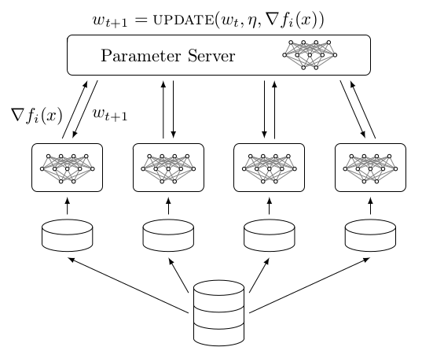

# Distributed TensorFlow Guide
 

This guide is a collection of distributed training examples (that can act as boilerplate code) and a tutorial of basic distributed TensorFlow.  Many of the examples focus on implementing well-known distributed training schemes, such as those available in [*dist-keras*](https://github.com/cerndb/dist-keras) which were discussed in the author's [blog post](http://joerihermans.com/ramblings/distributed-deep-learning-part-1-an-introduction/). 
 
<div align="center">

</div>

Almost all the examples can be run on a single machine with a CPU, and all the examples only use data-parallelism (i.e., between-graph replication).

The motivation for this guide stems from the current state of distributed deep learning.  Deep learning papers typical demonstrate successful new architectures on some benchmark, but rarely show how these models can be trained with 1000x the data which is usually the requirement in industy.  Furthermore, most successful distributed cases use state-of-the-art hardware to bruteforce massive effective minibatches in a synchronous fashion across high-bandwidth networks; there has been little research showing the potential of asynchronous training (which is why there are a lot of those examples in this guide).  Finally, the lack of documenation for distributed TF was the largest motivator for this project.  TF is a great tool that prides itself on its scalability, but unfortunately there are few examples that show how to make your model scale with data size.  

The aim of this guide is to aid all interested in distributed deep learning, from beginners to researchers.

## Basics Tutorial

See the Basics-Tutorial folder for notebooks demonstrating core concepts used in distributed TensorFlow.  The rest of the examples assume understanding of the basics tutorial.

* [`Servers.ipynb`](Basics-Tutorial/Servers.ipynb) -- basics of TensorFlow servers
* [`Parameter-Server.ipynb`](Basics-Tutorial/Parameter-Server.ipynb) -- everything about parameter servers
* [`Local-then-Global-Variables.ipynb`](Basics-Tutorial/Local-then-Global-Variables.ipynb) -- creates a graph locally then make global copies of the variables Useful for graphs that do local updates before pushing global updates (e.g., DOWNPOUR, ADAG, etc.)
* [`Multiple-Workers`](Basics-Tutorial/Multiple-Workers/) -- contains three notebooks: one parameter server notebook and two worker notebooks  The exercise shows how global variables are communicated via the parameter server and how local updates can be made by explicitly placing ops on local devices


## Training Algorithm Examples

The complete list of examples is below. The first example, [`Non-Distributed-Setup`](Non-Distributed_Setup.py), shows the basic learning problem we want to solve distributively; this example should be familiar to all since it doesn't use any distributed code.  The second example, [`Distributed-Setup`](Distributed-Setup/), shows the same problem being solved with distributed code (i.e., with one parameter server and one worker). The remaining examples are a mix of synchronous and non-synchronous training schemes.

* [`Non-Distributed-Setup`](Non-Distributed_Setup.py)
* [`Distributed-Setup`](Distributed-Setup)
* [`HogWild`](Hogwild) (Asychronous SGD)
* [`DOWNPOUR`](DOWNPOUR)
* [`DOWNPOUR-Easy`](DOWNPOUR-Easy/)<sup>1</sup>
* [`AGN`](AGN) (Accumulated Gradient Normalization)
* [`Synchronous-SGD`](Synchronous-SGD/)
* [`Synchronous-SGD-different-learning-rates`](Synchronous-SGD-different-learning-rates/)
* [`SAGN`](SAGN) (Synchronous Accumulated Gradients Normalization)
* [`Multiple-GPUs-Single-Machine`](Multiple-GPUs-Single-Machine/)
* `Dynamic SGD` **TODO**
* `Asynchronous Elastic Averaging SGD` (AEASGD) **TODO**
* `Asynchronous Elastic Averaging Momentum SGD` (AEAMSGD) **TODO**


<sup>1</sup>This is the same as the DOWNPOUR example except that is uses SGD on the workers instead of Adagrad.

## Running Training Algorithm Examples
All the training examples (except the non-distributed example) live in a folder.  To run them, move to the example directory and run the bash script.

```bash
cd <example_name>/
bash run.sh
``` 

In order to completely stop the example, you'll need to kill the python processes associated with it.  If you want to stopped training early, then there will be python processes for each of the workers in addition to the parameter server processes.  Unfortunately, the parameter server processes continue to run even after the workers are finished--these will always need to be killed manually.   To kill all python processes, run pkill.

```bash
sudo pkill python
```

## Requirements

* Python 2.7
* TensorFlow >= 1.2


## Links
* [Official Documenation](https://www.tensorflow.org/deploy/distributed)
* [Threads and Queues](https://www.tensorflow.org/programmers_guide/threading_and_queues)
* [More TensorFlow Documentation](https://www.tensorflow.org/api_guides/python/train#Distributedexecution)

## Glossary
* [Server](https://www.tensorflow.org/api_docs/python/tf/train/Server) -- encapsulates a Session target and belongs to a cluster
* [Coordinator](https://www.tensorflow.org/api_docs/python/tf/train/Coordinator) -- coordinates threads
* [Session Manager](https://www.tensorflow.org/api_docs/python/tf/train/SessionManager) -- restores session and initialized variables and coordinates threads
* [Supervisor](https://www.tensorflow.org/api_docs/python/tf/train/Supervisor) -- good for threads. Coordinater, Saver, and Session Manager. > Session Manager
* [Session Creator](https://www.tensorflow.org/api_docs/python/tf/train/SessionCreator) -- Factory for creating a session?
* [Monitored Session](https://www.tensorflow.org/api_docs/python/tf/train/MonitoredSession) -- Session.  initialization, hooks, recovery.
* [Monitored Training Session](https://www.tensorflow.org/api_docs/python/tf/train/MonitoredTrainingSession) -- only distributed solution for sync optimization
* [Sync Replicas](https://www.tensorflow.org/api_docs/python/tf/train/SyncReplicasOptimizer) -- wrapper of optimizer for synchronous optimization
* [Scaffold](https://www.tensorflow.org/api_docs/python/tf/train/Scaffold) -- holds lots of meta training settings and passed to Session creator

### Hooks
* [LoggingTensorHook](https://www.tensorflow.org/api_docs/python/tf/train/LoggingTensorHook) -- prints tensors every *N* steps or seconds
* [StopAtStepHook](https://www.tensorflow.org/api_docs/python/tf/train/StopAtStepHook) -- requests to stop training at a certain step
* [StepCounterHook](https://www.tensorflow.org/api_docs/python/tf/train/StepCounterHook) -- counts steps per second
* [CheckpointSaverHook](https://www.tensorflow.org/api_docs/python/tf/train/CheckpointSaverHook) -- saves new checkpoint every *N* steps or seconds
* [NanTensorHook](https://www.tensorflow.org/api_docs/python/tf/train/NanTensorHook) -- stops training if loss is NaN
* [SummarySaverHook](https://www.tensorflow.org/api_docs/python/tf/train/SummarySaverHook) -- saves summaries every *N* steps or seconds
* [GlobalStepWaiterHook](https://www.tensorflow.org/api_docs/python/tf/train/GlobalStepWaiterHook) -- waits until global step reaches threshold before training
* [FinalOpsHook](https://www.tensorflow.org/api_docs/python/tf/train/FinalOpsHook) -- runs specified ops before closing session
* [FeedFnHook](https://www.tensorflow.org/api_docs/python/tf/train/FeedFnHook) -- assigns feed_dict

## Algorithm References

* [Hogwild!](https://people.eecs.berkeley.edu/~brecht/papers/hogwildTR.pdf)
* [DOWNPOUR](https://static.googleusercontent.com/media/research.google.com/en//archive/large_deep_networks_nips2012.pdf)
* [ADAG](http://joerihermans.com/ramblings/distributed-deep-learning-part-1-an-introduction/)
* [AGN](https://arxiv.org/abs/1710.02368)
* [EASGD and EAMSGD](https://arxiv.org/abs/1412.6651)
